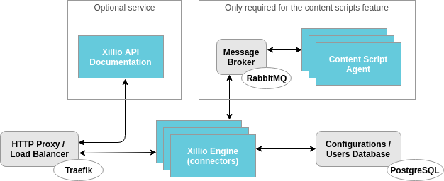

= Xillio API Architecture

The Xillio API is a modular system.
We have developed isolated services which can be enabled or disabled to match your use-case and scale to your needs.

The simplest deployment contains:

- <<rest-api-and-connectors>>
- <<traefik>>
- <<postgresql>>

[#rest-api-and-connectors]
== Xillio Engine

The core functionality of Xillio API is powered by the Xillio Engine service.
This service contains all connectors and the REST API.
Because of its design, you can run many of these services in parallel at the same time.

IMPORTANT: This is a required service, as it is the entrypoint for all operations.

== Content Script Agent

The content script agent allows you to run custom Node.js scripts on document content before it is returned by our API.
This service is optional and is only used when you make use of our https://docs.xill.io/#_content_scripts[Content Scripts] feature.
If this service is used, then the <<rabbitmq>> service is also required.

Depending on your throughput you can scale this agent up.
Every agent can run one script at a time and is extremely lightweight.
If you expect to making about 20 calls a second, we recommend you run 15 to 20 agents.

== Xillio Admin Portal

We provide a tenant administration UI which allows you to manage tenants in a multi-tenant environment.
Management of these tenants is possible through the API but the Admin Portal service provides a layer on top of that
in the form of a GitHub organization authenticated user interface.

== Dependencies

Xillio API requires several third-party technologies to operate.
These are all run in the Docker swarm so there is no need to install them.

[#traefik]
=== Traefik

To expose Xillio API as a single service we employ an HTTP load balancer and proxy combination.
Our preferred technology is Traefik, a lightweight load balancer which can be automatically configured through Docker and scales with your swarm.

IMPORTANT: This is a required service.

[#postgresql]
=== PostgreSQL

Xillio API requires PostgreSQL to store its configuration.
In this database we store tenants, users, target system configuration, content scripts, etc...
We do *NOT* use this database to store any documents or metadata about those documents.
You could even opt to not store any target system credentials by using our https://docs.xill.io/#_passthrough_authorization[Passthrough Authorization] feature.

IMPORTANT: This is a required service.

[#rabbitmq]
=== RabbitMQ

RabbitMQ is a message broker that enables communication between services.
This also allows us to scale services individually without having to take down the entire cluster.
